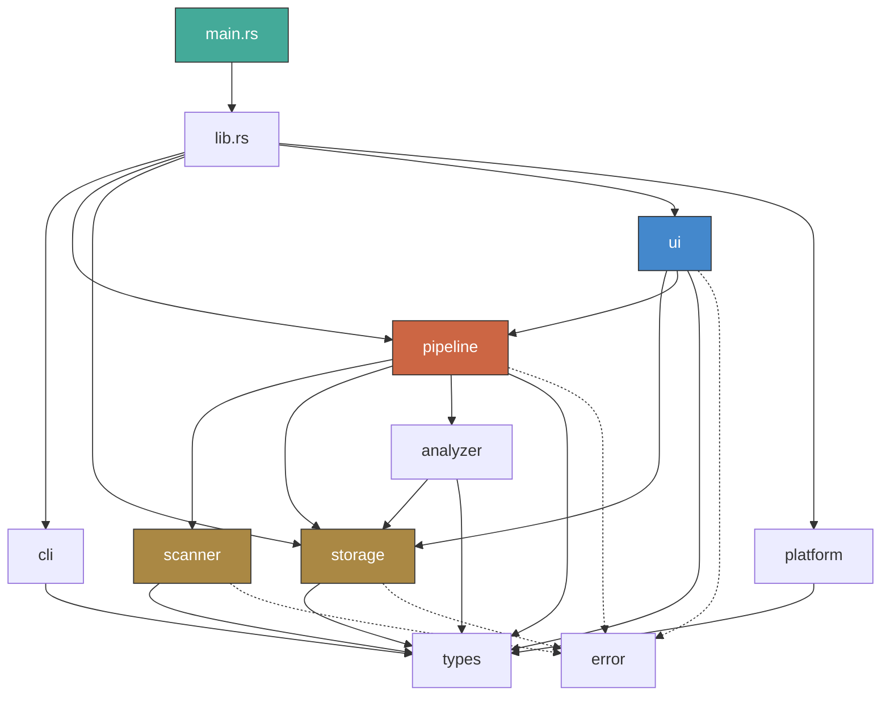
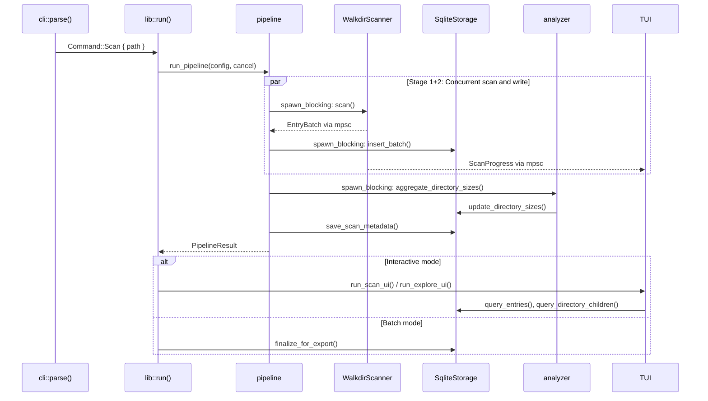
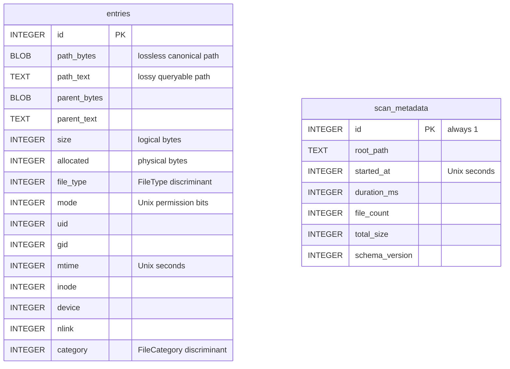
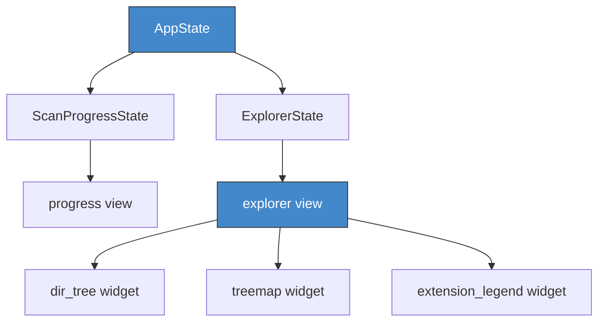

# Architecture

## Module Dependency Graph

## Scan Pipeline (Data Flow)

## Storage Schema (v2)

## TUI Component Tree

## Module Responsibilities

| Module | Purpose |
|--------|---------|
| `cli` | Argument parsing, bare-path resolution |
| `scanner` | `Scanner` trait, `WalkdirScanner` filesystem walker |
| `storage` | `ReadStorage`/`WriteStorage` traits, `SqliteStorage` impl |
| `pipeline` | Async coordinator: scanner → writer → aggregation |
| `analyzer` | Directory size aggregation, free space query |
| `ui` | Terminal setup/teardown, event loop, TUI views and widgets |
| `platform` | Platform-specific filesystem detection (Linux/macOS/FreeBSD) |
| `types` | Domain types: `FileEntry`, `FileCategory`, `ScanConfig`, etc. |
| `error` | `ScanError`, `StorageError`, `PipelineError`, `UiError` |
